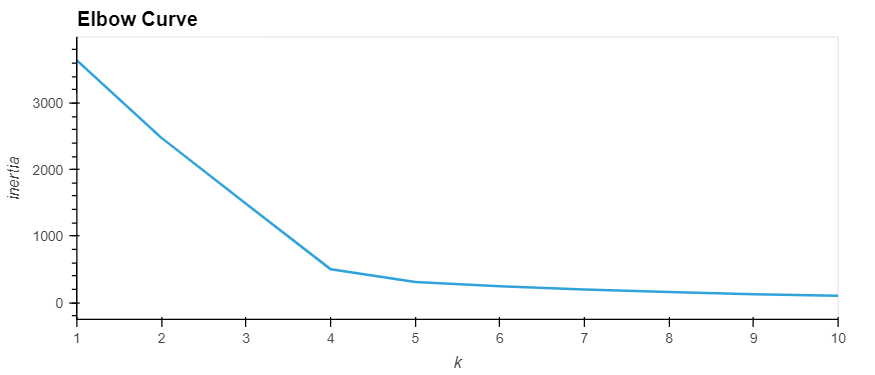
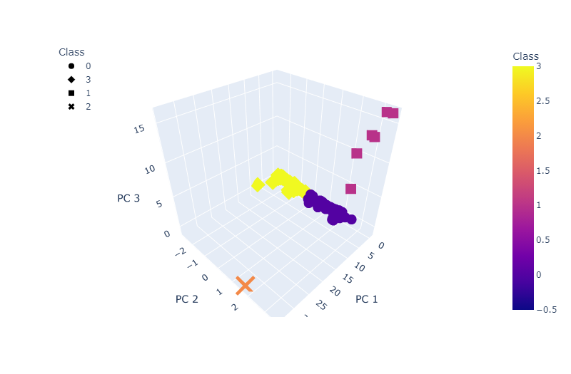
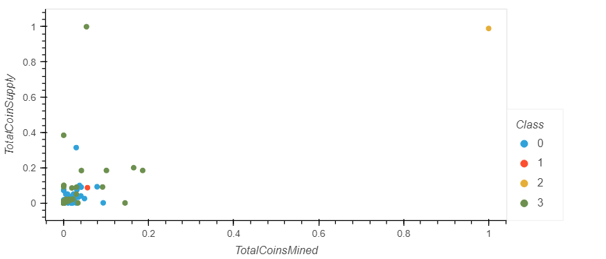

# Cryptocurrencies

### **Overview**

This project is a mock scenario in which an Advisory Services Team at _Accountability Accounting_. Accountability Accounting, a prominent investment bank, is interested in offering a new cryptocurrency investment portfolio for its customers. The company wants to create a report that includes what cryptocurrencies are on the trading market and how they could be grouped to create a classification system for this new investments.

The data to work on stored at _crypto\_data.csv_ and was retrieved from [CryptoCompare](https://min-api.cryptocompare.com/data/all/coinlist). First the data needed to be processed to fit the machine learning models. Since there is no known output for what the company is looking for, unsupervised learning was used. And to group the cryptocurrencies, clustering algorithm was used. Then the data was visualized to be shared with the board.

This new assignment consists of four technical analysis deliverables.

- Deliverable 1: Preprocessing the Data for PCA
- Deliverable 2: Reducing Data Dimensions Using PCA
- Deliverable 3: Clustering Cryptocurrencies Using K-means
- Deliverable 4: Visualizing Cryptocurrencies Results

### **Results**

- Elbow Curve

- 3D-Scatter with the PCA data and the Clusters

- Tradable Cryptocurrencies

- Hvplot Scatter Plot

